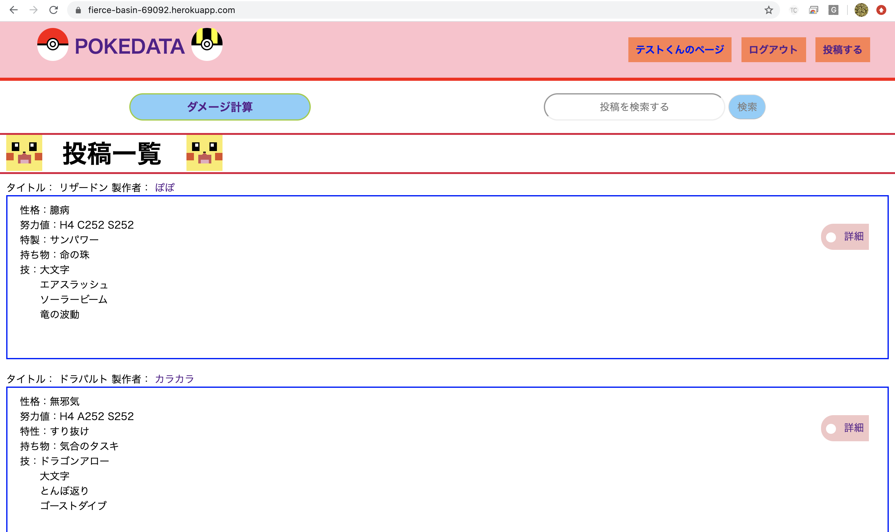
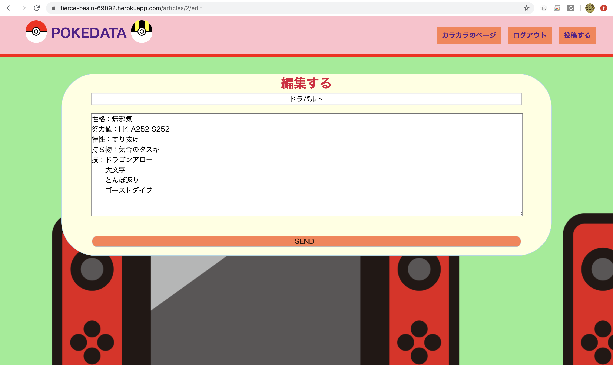
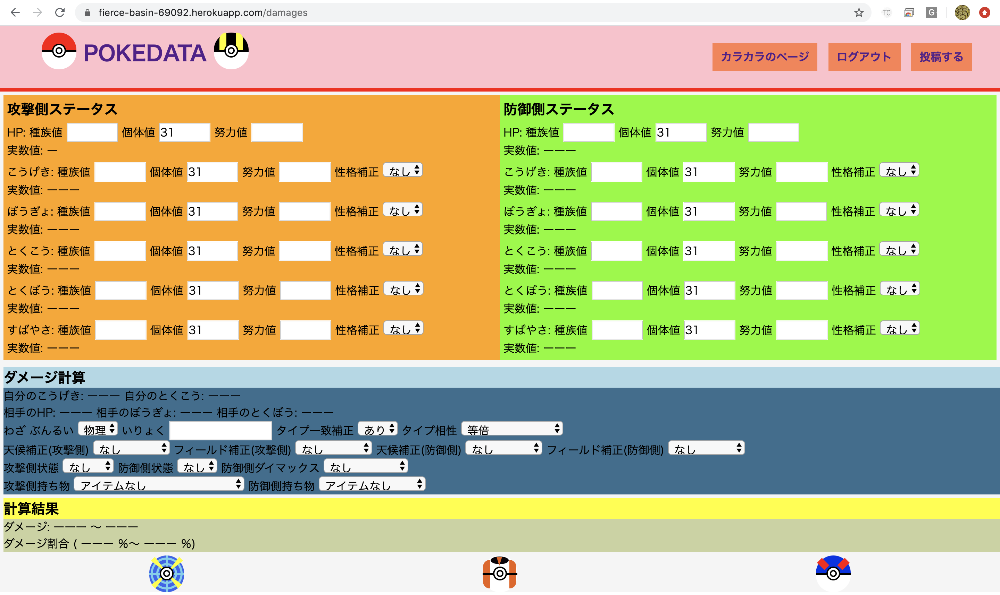

# アプリ概要
  ゲーム『ポケットモンスター』シリーズのゲーム本編におけるダメージ計算アプリです。   
  自身で育成したキャラの育成案を投稿する機能もあります。  
  本販環境のURLです ⇨ https://fierce-basin-69092.herokuapp.com/damages  
  テスト用アカウント email:aaa@aaa.com  / パスワード:aaaaaaaa

## 作成経緯
  自分自身ゲームをプレイしている最中に利用する機能なので、自分自身で作ってみようと思い立ち作成を開始いたしました。
  より細かい条件での指定など、作る中で他にはない利点なども盛り込んでいきより使いやすいアプリを目指しました。

## 開発環境
- Haml
- Sass
- jQuery
- Ruby on Rails
- pg(本番環境)
- MySQL(開発環境)

## 機能
  自身の育成したキャラクターの情報などの記事を投稿して他者に閲覧してもらい交流する機能。  
  ゲーム内キャラクターの情報を打ち込むことでダメージを計算して算出してくれる機能。

## 今後追加したい機能や課題
- 投稿機能
  - いいね機能などより深く交流ができる機能の実装
  - 投稿をフォーマット化して分かりやすい記事が誰でも投稿できるように。
- 検索機能
  - チェックボックスなどを利用して直感的な操作ができるようにすること。
  - 足りない計算条件を追加する。

## 工夫した点
  見た目を華やかにするためにcssでポケモンのサイトらしさを出しました。

## DEMO(アプリ画面)
  **トップページです。**

  

  **編集画面です。**
  

  **ダメージ計算画面です。**
  

# pokesite テーブル設計
## usersテーブル
|Column|Type|Option|
|------|----|------|
|email|string|null: false|
|name|string|null: false|
|password|string|null: false|
### Association
- has_many :articles
- has_many :comments

## articlesテーブル
|Column|Type|Option|
|------|----|------|
|title|string||
|body|text||
|user_id|integer|null: false, foreign_key: true|
### Association
- belongs_to :user
- has_many :comments

## commentsテーブル
|Column|Type|Option|
|------|----|------|
|text|string|null: false|
|user_id|integer|null: false, foreign_key: true|
|article_id|integer|null: false, foreign_key: true|
### Association
- belongs_to :user
- belongs_to :article
